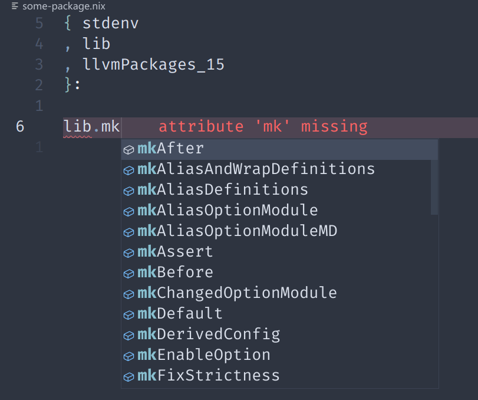
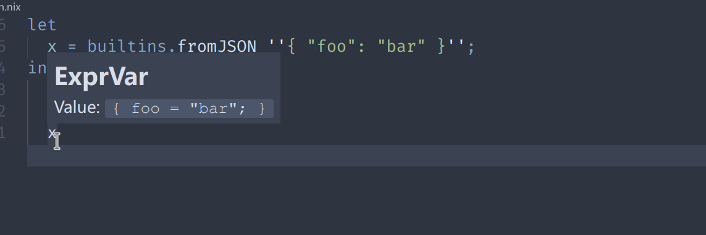
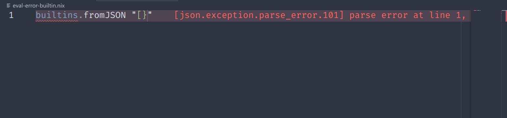

  <h1>nixd</code></h1>

  

    <strong>Nix language server</strong>
  

## About

This is a Nix language server that directly uses (i.e., is linked with) the official Nix library (https://github.com/NixOS/nix).

Some notable features provided by linking with the Nix library include:

- Nixpkgs option support, for all option system (NixOS/home-manager/flake-parts).
- Diagnostics and evaluation that produce identical results as the real Nix command.
- Shared eval caches (flake, file) with your system's Nix.
- Native support for cross-file analysis.
- Precise Nix language support. We do not maintain "yet another parser & evaluator".
- Support for built-ins, including Nix plugins.

## Features Preview

Home-manager options auto-complete & goto declaration

See how to configure option system: https://github.com/nix-community/nixd/blob/main/docs/user-guide.md#options

Write a package using nixd

Native cross-file analysis

See how to configure the evaluator for cross-file analysis: https://github.com/nix-community/nixd/blob/main/docs/user-guide.md#evaluation

Handle evaluations exactly same as nix evaluator

Support *all* builtins

And diagnostic:

## Resources

- [User Guide](docs/user-guide.md)
- [Developers' Manual](docs/dev.md) (internal design, contributing):
- Project matrix room: https://matrix.to/#/#nixd:matrix.org

## Tooling

We provide some extra tools based on our codebase.

### nix-ast-dump

Used for dumping internal data structures in nix parser.

Demo: [all-grammar.nix](tools/nix-ast-dump/test/all-grammar.nix)

